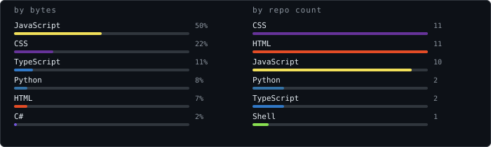
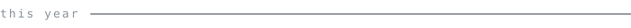
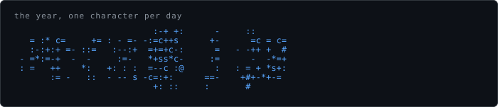

<h1 align="center">Bruno Eiji</h1>

<samp>front-end · UI/UX · design systems</samp>

<blockquote align="center">
Front-end developer who cares about how things look as much as how 
they work — usually somewhere between a design file and a React tree.
</blockquote>

    

    
    

     
     
    

    

<a href="#top"><samp>back to top</samp></a>

