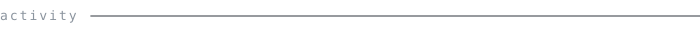
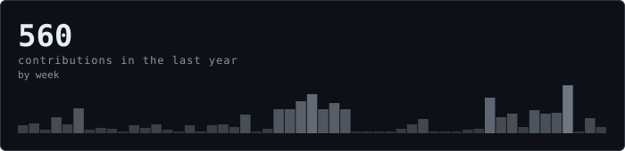
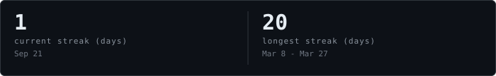

<h1 align="center">Bruno Eiji</h1>
<blockquote align="center">
<samp>developer analyst · UI/UX · design systems</samp>
</blockquote>

    <samp>Bootstrap · CSS · Figma · GitHub · HTML · JavaScript · jQuery · Photoshop · React · Styled Components · Adobe XD</samp>

    <a href="https://www.instagram.com/brunoeiji1/"><samp>Instagram ↗</samp></a>
    &nbsp;·&nbsp;
    <a href="https://www.linkedin.com/in/bruno-eiji-1b47b1206/"><samp>LinkedIn ↗</samp></a>

     
    

<a href="#top"><samp>back to top</samp></a>

